# Troop 284 Website -- Content Editor Guide

This document is a guide to adding and editing content for the Troop 284 [website](https://www.bsatroop284.org/).

## First Steps

Ok, so you have been tasked with adding or updating some content for the site.  This document should be enough to get you started. If you hit any problems or have questions please ask [Dave](mailto:davidpfeeley@gmail.com) for help.

## Website Structure

The website is a [nuxt.js](https://nuxtjs.org/) static site hosted on [Netlify](https://www.netlify.com/) and serving content that is stored (and edited) in [Sanity.io](https://www.sanity.io/) CMS.  

Don't worry, if these terms don't mean anything to you ... in your role as a Content Editor they don't need to!  The practice of using the content-editing tool is far simpler than the technical machinery around it.

But it will be helpful to know what a **CMS** (**Content Management System**) is, so if you are not familiar with this term please have a quick look [here](https://pagely.com/kb/en/what-is-a-cms/).  

As mentioned in that explainer, traditional CMS's in the past (like **Wordpress**) served two purposes:

1. Creating / editing content, **and** 
2. Presenting that content in the form of a website.  

Over time people have found that its better to split up these 2 functions ... which means that content writers can work in an app that is tailored for writing content, and website developers can build whatever kind of website they want without being constrained within the confines of the CMS app.

For extra credit you could read this other short explainer on this concept of a [headless CMS](https://www.sanity.io/blog/headless-cms-explained), which is what we  are using for Troop 284.

We're almost done with the background, and will get on very soon to the concrete steps of how to actually **do stuff**, but as a quick mental model of what we're dealing with here, try to keep these bullets in mind:

* Sanity.IO **backend** is where we write the words & upload the pictures that make up the content of our site
* The website **frontend** knows the structure (pages, sections of pages) of the site, and has the code to retrieve the content from Sanity and insert it into the right place in the structure.
* **Netlify** is a website hosting service that ties the frontend & backend together, it 'builds' a version of the website (by inflating the content into the structure) and then serves that version out to the world at the [www.bsatroop284.org](https://www.bsatroop284.org/) address

And so the high-level process you will go through as a content creator / editor will be:

1. In Sanity.IO, add / edit content as you wish.  You **Publish** your changes when you are done ... this is just Sanity.IO saving your changes internally, they are not yet live on the Troop284 website.
2. You tell Netlify to build & deploy a new version of the site ... it fetches the updated content that you have just saved in Sanity and inflates it into the right places in the site and then makes this new version the one that people see when they visit.

Although Step 2. is a Netlify action, you can trigger this from Sanity.IO, so in practice you will be doing both steps in Sanity.

## Lets Change some Content

Ok, lets get started, here we are going to make 2 updates:

1. Change out some of the photos in the Camping section of the Activity page.
2. Add a new 'Upcoming Activity'  -- backpacking trip to Point Reyes

First step - log in to Sanity.io at this address [https://troop284.sanity.studio/desk](https://www.bsatroop284.org/), using these credentials:

	username: troop284webeditor@gmail.com
	password: dooWoiLeiv1h
 
Ok, you should see a screen showing a list of Content categories down the left hand side ... Front Page, Front Page Sections, Activities Page, etc.
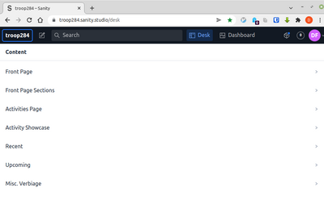

Lets take a look at the 4th item -- Activity Showcase.  Click on it and you will see a list appear to its right ... Summer Camp, Adventures & Outings, etc.  

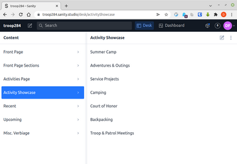

Each of these corresponds to one of the sections on the Activity page of the website.  

Click on the Camping one and at last we get to see some actual content, viz;

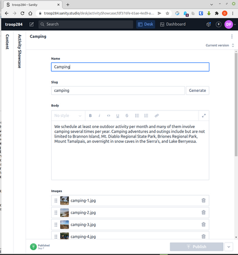

As you can see these activity showcase sections are pretty simple -- they have a **Name**, a **Slug** (a kind of identifier that the website will know this item by), a paragraph of text (the **body**), and finally a **list of images**.

If you wanted to change the body text you would do so here, but for this change we are just swapping out some photos.

First we will delete some old ones that we are getting rid of.  Each image has a trash icon on the right hand side for removing it.  The thumbnails are small, but clicking on one will show you a larger version if you aren't sure which image is which.  

After deleting the ones that are getting discarded, you can now add the new photos.  You can click the 'Add item' to add images one by one.

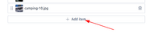

You can also drag one or more images from your file explorer and drop them over the image list. When images have been uploaded (and you can see their thumbnails now in the image list), you can re-order them as you wish using the '6-dot' selectors on the left hand side -- drag these up & down to reposition.

The **Publish** button becomes enabled (turns green) when there have been changes.  

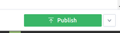

Click it to save your updates.

That completes **Step 1** -- Sanity has now got the updated content.  

However these changes are not yet reflected on the website.  The website does not pull its content on demand from Sanity -- that would be too slow, instead the website gets built (and rebuilt) whenever there are a batch of content changes to reflect.

You can tell **Netlify** to build and deploy a new version right from within Sanity. 

Click on the 'Dashboard' tab on the top of the Sanity screen.  

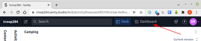

You will see a heading 'My Netlify Deploys', and a single item -- our Troop 284 site.  See the grey button 'Deploy' on the right hand side ... click it, and see the status of the website go from 'success' to 'building'.  

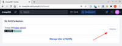

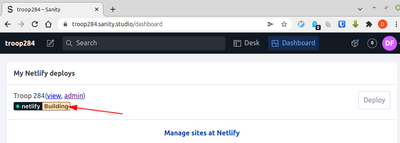

After about a minute, this will change back to 'success', indicating that the build is complete, and the new version of the site with your updates is now live! 

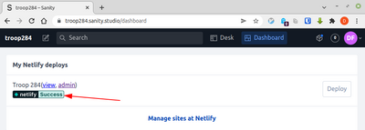

## Adding an Upcoming Activity

Ok, with that win under our belt, lets now do our second update ... the addition of a new Upcoming Activity.

Click back into the 'Desk' tab to get back to our content, and see if you can figure out which Content item on the left is the one for **Upcoming Events**.  Yes, you're good, its this one:

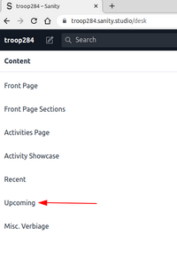

Click on it and you will see a list of the Upcoming activities.  From here you could click into one to update it, but for us we are adding a new one, so instead click on the 'add new' button on the right hand side.  

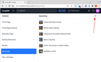

Ok, here you get to add a Name, an image, some verbiage describing the event, a date, and a map location / map pin.

As before, click **Publish** when you are done here, and then trigger a Netlify deploy from the **Dashboard** to build the new version of our site.

**Aside:** If you are particularly observant you may spot some 'Upcoming' activities that have actually already taken place.  Does this mean that they are showing up incorrectly in the website?  Actually no, when the website is being built its smart enough to filter out events where the date is in the past.  So as time rolls by and events take place, we don't have to be particularly diligent about deleting the old content, as long as the website is getting rebuilt once in a while those 'upcoming' items will drop off on their own.

Congratulations, you are now a proud Troop 284 content editor, go forth and write fresh copy and upload shiny images!

## But what about ... 

But wait, what if you mess something up, or delete some content, or break the website, etc, etc.  

Should you really be trusted with this power?  Is it **safe**?  

Well actually, yes!  First of all Sanity keeps a full history of all changes made, which makes it really easy to go back to a previous version of some content if something was changed inadvertently.  So if you delete the wrong photo and can't get it back, or you delete a whole page somehow, it is all pretty easy to recover, right from within Sanity.

(see that 'Current Version' thingy on the top right of each content item ... click on that and you will see what I mean about the previous versions).

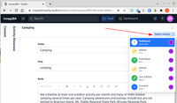

Yes but what if some content actually breaks the website and the Netlify deploy fails?  

Well in that case the website will still be happily serving up the last good version of the site, ie. nothing changes unless/until a build has **succeeded**.  

So even if you have broken something, you haven't really broken it (yet) from the perspective of the wider world.  And so this where you would let Dave know that something is broken (while offering up the usual excuses of 'wasn't me guv, all I did was fix a typo, honest!, etc).

